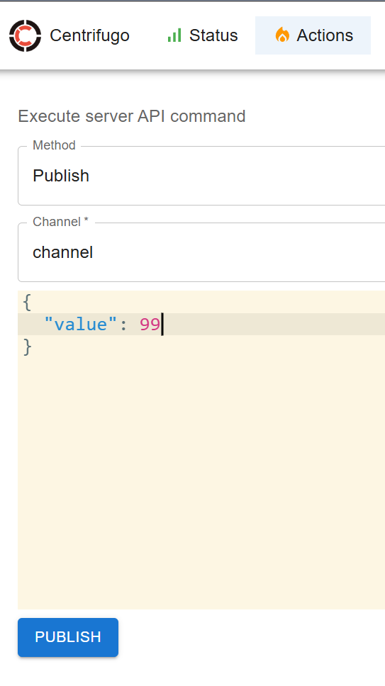

# Centrifugo - Demo

This sample demonstrates the following:

- Start Centrifugo Docker Container with minimal setup
- A basic html page to subscribe/receive Centrifugo messages
- Publish message using Centrifugo admin
- Publish message using HTTP POST through Postman
- Connect/Receive WebSocket messages through Postman

### Prerequisites

- Docker
- python or node to host/run web app

### Steps

- following starts Centrifugo container

```
docker compose -f docker-compose-start.yml up -d
```

- open http://localhost:8000 in browser and loging use password provided in `config.json`. We can also publish messages using `Actions` in the app.

- following starts http server (using python). You can do similarly using Node as well.

```
cd test-web-app
python -m http.server 3000
```

- open http://localhost:3000 in browser. Check console messages using Dev Tools.

- Publish and test websockets. Check screenshots below.

### Sample Screenshots

- Centrifugo server running....
  

- Test Web App running, connected/subscribed to Centrifugo server through web sockets. Check Dev Tools!
  

- Publish a message (to channel named "channel") using Centrifugo admin screen
  

- Test Web App consuming/displaying the above published message. Check Dev Tools!
  

- Connect to Centrifugo server through Web Socket protocol using Postman. Need to press "Connect" and within short duration "Send". Keep it open to consume messages.
  

- Publish a message (to channel named "channel") using HTTP POST using Postman
  
  

- Test Web App consuming/displaying the above published message. Check Dev Tools!
  

- Websocket connection in Postman displays the above published message.
  

### Stop services

- following stops Centrifugo container

```
docker compose -f docker-compose-start.yml down
```

- Press Ctrl-C for python based http server to stop
